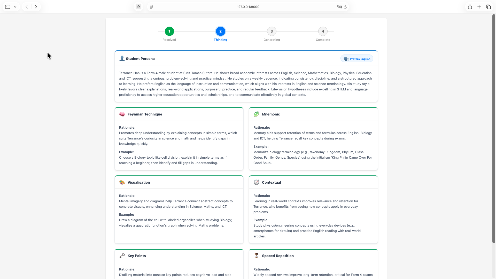

# Student Persona Generator

A FastAPI application that generates detailed student personas using AI (OpenAI GPT). 
It collects student information via a web form and uses LangChain to generate a streaming response of a student persona.
**Langfuse** is integrated for monitoring and tracing LLM executions.

## Setup & Running

1.  **Activate Virtual Environment**
    ```bash
    source venv/bin/activate   # macOS/Linux
    venv\Scripts\activate      # Windows
    ```

2.  **Install Dependencies**
    ```bash
    pip install -r requirements.txt
    ```

3.  **Environment Setup**
    Create a `.env` file with your API keys:
    ```env
    OPENAI_API_KEY=...
    LANGFUSE_SECRET_KEY=...
    LANGFUSE_PUBLIC_KEY=...
    LANGFUSE_HOST=https://cloud.langfuse.com
    ```

4.  **Run the Application**
    ```bash
    uvicorn main:app --reload
    ```

The application will be available at `http://127.0.0.1:8000`.

## Preview



### End Result
The application generates a comprehensive **Student Persona** based on the input provided. The result includes:
1.  **Student Persona**: A detailed narrative describing the student's academic background, interests, and learning style.
2.  **Language Preference**: An analysis of the student's preferred language for studying.
3.  **Learning Methods**: Tailored recommendations for 6 specific learning techniques (e.g., Feynman Technique, Mnemonics, Visualisation) with rationales and subject-specific examples.

The generation process is visualized with a stepper, showing "Received", "Thinking" (with a summary of the input), "Generating", and "Complete" stages.
